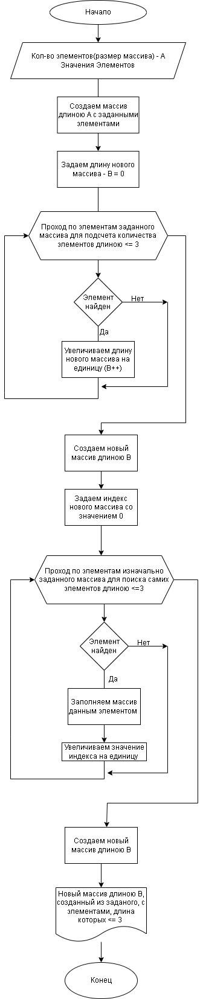

# Описание решения задачи

## **Задача.**

    Написать программу, которая из имющегося массива строк формирует массив строк, длина которых меньше либо равна 3. Первоначальный массив ввести с клавиатуры, либо задать на старте выполнения алгоритма. Не рекомендуется пользоваться коллекциями.

В данном материале будет предствалено решение задачи с помощью блок-схемы (приложена сама схема) и с помощью программы, в Visual Studio Code.
___

## 1. Блок - схема

(Будет краткое описание, в какой программе нарисована и показана сама блок-схема.)

## 2. Программа

(Будет описание решения, сам код и ссылка на репозиторий).
 
 
 
 

   ## БЛОК-СХЕМА  
   
* Ввод данных от пользователя для создания изначального массива (размер массива, значения элементов).

* Определение длины нового массива путем перебора всех элементов заданного массива и проверки этих элементов на количество символов.

* Создание нового массива и заполнение его новыми элементами, длина которых меньше либо равна трём символам.

* Вывод массивов на печать.  

    
